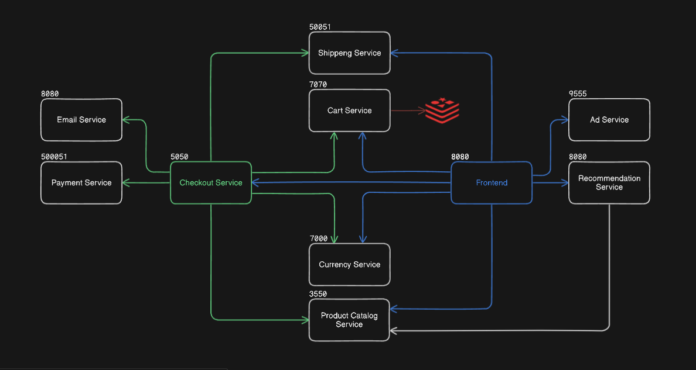
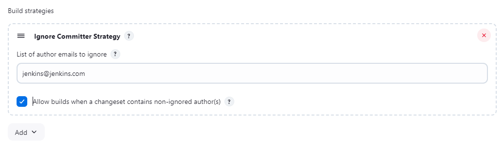
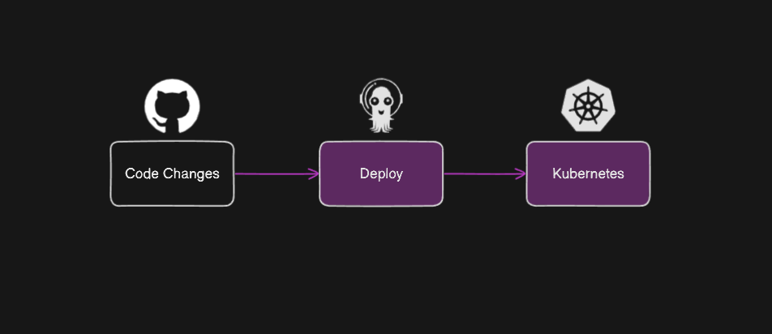

# market-app

<a href="https://github.com/GoogleCloudPlatform/microservices-demo.git">Based on microservices-demo</a> 

- [Prerequisites](#prerequisites)
- [Architecture](#architecture-)
- [Infrastructure and Tools](#infrastructure-and-tools-)
    - [Setting up Jenkins](#setting-up-jenkins-)
    - [Setting up Nexuss](#setting-up-nexus-)
- [YAML files](#yaml-files-)
- [CI/CD Pipeline](#cicd-pipeline-)
  - [CI Pipeline](#ci-pipeline-)
    - [Building & Pushing docker images](#building--pushing-docker-images-)
    - [Updating the Version](#updating-the-version-)
    - [Pushing the version change](#pushing-the-version-change-)
  - [CD Pipeline](#cd-pipeline-gitops-with-argocd-)
    - [Setting up Argocd](#setting-up-argocd-on-the-k8s-cluster-)
    - [Configuring Argocd](#configuring-argocd-)
- [Results](#results-)

A containerized online boutique app with 11 microservices built ,pushed and deployed with a CI/CD pipline using Docker ,Jenkins ,Nexus , Argocd and an on premesis Kubernetes cluster setup with kubeadm using vagrant 

## Prerequisites :

* Docker
* A kubernetes cluster
* Jenkins 
* Nexus
* Argocd

## Architecture :



| Service                       |               | Description                                                       |
| ----------------------------- | ------------- | ----------------------------------------------------------------- |
| frontend                      | Go            | serve the website                                                 |
| cartservice                   | C#            | stores selected items in the shopping cart                        |
| productcatalogservice         | Go            | list ,search and select products                                  |
| currencyservice               | Node.js       | converts currency                                                 |
| paymentservice                | Node.js       | charges the given credit card (mock)                              |      
| shippingservice               | Go            | extimate shipping cost (mock)                                     |
| emailservice                  | Python        | sends emails about the transactions (mock)                        |                                                         
| checkoutservice               | Go            | manage the cart ,order ,shipping ,payment and email notifications |                           
| recommendationservice         | Python        | recommends other products                                         |                            
| adservice                     | Java          | provides text ads                                                 |

## Infrastructure and Tools :


* A Kubernetes cluster setup with kubeadm using vagrant
    - here is guide to how to setup a k8s cluster with vagrant and kubeadm <a href="https://github.com/vancanhuit/vagrant-k8s">vagrant-k8s</a>
* A Jenkins container, setup on a VM (4Cpu,6Ram) runnig on port 8080
* Nexus repository on the same VM running on port 8081
* Argocd installed on the k8s cluster and exposed on port 32000
* I recommend using the same network CIDR if youre using this infrastructure locally

### Setting up Jenkins :

* follow this guide to set up jenkins with as a container <a href="https://github.com/hamdiz0/LearningDevOps/blob/main/jenkins/jenkins.md#doker-in-jenkins">Docker in Jenkins</a>

### Setting up Nexus :

* For the docker registry you can use Docker Hub or others, in this case i used Sonatype Nexus
* install & start Nexus :
    ```
    sudo apt install openjdk-17-jdk openjdk-17-jre
    wget https://sonatype-download.global.ssl.fastly.net/repository/downloads-prod-group/3/nexus-3.74.0-05-unix.tar.gz
    tar -zxvf nexus-3.74.0-05-unix.tar.gz
    nexus-version/bin/nexus start
    ```
* setup a docker hosted registry (repository => create repository => docker hosted ) :

    

* create a role that grants access to the created registry (admin setting => roles => create role) :

    

* create jenkins & kubernetes users in Nexus (you can create one for both) :
    - make sure to add the created docker hosted role to these users 
    

* allow jenkins and the k8s cluster to pull & push images :
    * for docker runtime :
        - edit the daemon.json file :
            ```
            sudo nano /etc/docker/daemon.json
            ```
            * configuration example :
                ```
                {
                insecure-registries": ["192.168.1.16:8082"]
                }
                ```
            * restart docker :
                ```
                sudo systemctl restart docker
                ```
    * for containerd runtime :
        - create & edit the hosts.toml file :
            ```
            sudo mkdir -p /etc/containerd/certs.d/192.168.1.16:8082/
            sudo nano /etc/containerd/certs.d/192.168.1.16:8082/hosts.toml
            ```
            * configuration example :
                ```
                server = "http://192.168.1.16:8082"
                [host."http://192.168.1.16:8082"]
                capabilities = ["pull", "resolve"]
                ```
        - modify the config file :
            ```
            sudo nano /etc/containerd/config.toml
            ```
            * add this :
                ```
                [plugins."io.containerd.grpc.v1.cri".registry]
                config_path = "/etc/containerd/certs.d"
                ```
        - restart containerd:
            ```
            sudo systemctl restart containerd
            ```

## YAML files :

* set up a deployment with its corresponding service for each microservices
* utilized a script to manually deploy and test the app on the k8s cluster
    - view the `run.sh` script <a href="./k8s-manifests/run.sh">here</a>
    - view the YAML files <a href="./k8s-manifests">here</a>
* make sure to add secret in the k8s cluster to allow acces to the Nexus repo using the user created previously
    ```
    kubectl create secret docker-registry nexus-registry-secret --docker-server=192.168.1.16:8082 --docker-username=kubernetes --docker-password=kubernetes
    ```
* also make sure to add the imagePullSecrets and specify the secrect name in each YAML file
    ```
    template:
      metadata:
        labels:
          app: frontend
      spec:
        imagePullSecrets:
        - name: nexus-registry-secret
        containers:
          - name: frontend
            image: 192.168.1.16:8082/frontend:1.0.4
    ```

## CI/CD Pipeline :


## CI Pipeline :

* Utilized webhook triggers to launch the pipline automaticly
* I recommnad using Ngrok if youre planning on using webhooks on a local setup 
    - visit Ngrok <a href="https://ngrok.com/">here</a>
    - more details about webhook triggers <a href="https://github.com/hamdiz0/LearningDevOps/blob/main/jenkins/jenkins.md#job-triggers">here</a>
* I also recommend using a multibranch pipline for its usefull plugins like the `Ignore Commiter Strategy` and `Multibranch Scan Webhook Trigger`


### Building & Pushing docker images :

* utilzed a function to build multiple images by passing a list of (ImageName with corresponding Docker File Location) pairs
    - view the funtcion <a href="./script.groovy">here</a>
    - example :
        ```
        def ImageName_DockerFileLocation=[['frontend','services/frontend'],['adservice','services/adservice']]
        gs.build(
            '192.168.1.16:8082',                    // Nexus repo url
            env.VERSION,                            // Version
            'nexus-jenkins',                        // Credentail Id for docker repo from jenkins 
            ImageName_DockerFileLocation            // List of pairs (Image Name along with Docker File Location)
        )
        ```
* another function pushes the images the docker registry by passing in a list of the built Image names 
    - view the funtcion <a href="./script.groovy">here</a>
    - example :
        ```
        ImageNames=['frontend','adservice']
            gs.push(
            '192.168.1.16:8082',                    // Nexus url
            env.VERSION,                            // Version
            'nexus-jenkins',                        // Credentail Id for docker repo from jenkins 
            ImageNames                              // List of Image Names
            )
        ```

### Updating the Version :

* utilized the `$BUILD_NUMBER` built in jenkins pipline variable in the versioning of the docker images
* implemeted a script that changes the YAML file image version after each commit
    - view the script <a href="./script.groovy">here</a>
        ```
        version=1.2.3
        file="./deployment.yml"
        sed -i "s|image: 192.168.1.16/\([^:]*\):.*|image: 192.168.1.16/\1:$version|" $file
        ```
        * search for this exact pattern "image: 192.168.1.16/`<imageName>`:`<version>`"
        * `\([^:]*\)` : capture the `<imageName>`
        * `.*` : select anything after ":"
        * `/1` : keep the same `<imageName>`=>`\([^:]*\)`
        * change the version to `$version`
        * `-i` : write directly in the file

### Pushing the version change :

* set up jenkins to updated the git repository with new YAML files version
* set up a git user.name and user.eamil for jenkins :
    ```
    docker exec -it jenkins bash
    git config --global user.name "jenkins"
    git config user.email "jenkins@jenkins.com"
    ```
* ustilized a function that adds and push changes to a git repository 
    - view the function <a href="./script.groovy">here</a>
* the function uses a git access token wish must be configured and added to jenkins as a `Username and Password` credentail
    - set up an access token in git hub :
    
* make sure to add the `Ignore Commiter Strategy` plugin and ignore jenkins pushes to avoid infinite build loops :
    

## CD Pipeline (GitOps with Argocd) :



### Setting up Argocd on the k8s cluster :
    
* install Argocd :
    ```
    kubectl create namespace argocd
    kubectl apply -n argocd -f https://raw.githubusercontent.com/argoproj/argo-cd/stable/manifests/install.yaml
    kubectl delete pod -n argocd --all # hard reset of the pods
    kubectl get pods -n argocd
    ```
* expose the ui on port 32000 :
    ```
    kubectl patch svc argocd-server -n argocd -p '{"spec": {"type": "NodePort", "ports": [{"port": 443, "targetPort": 8080, "nodePort": 32000}]}}'
    ```
* retrieve the admin password to login in th ui :
    ```
    kubectl get secret argocd-initial-admin-secret -n argocd -o jsonpath="{.data.password}" | base64 -d
    ```

### Configuring Argocd :

* create a new app and add the :
    - git repository url
    - branch 
    - YAML manifests location in the git rpository
    - destination cluster (https://kubernetes.default.svc for the current local cluster)
    - namespace 


* make sure the app is healthy and synched :


## Results :

* Jenkins pipline :


* Nexus repo :


* Argocd's deployment :


* kubectl get pods,svc,deploy :


* market-app :


